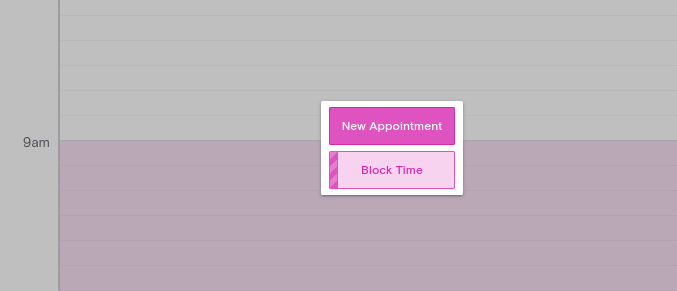
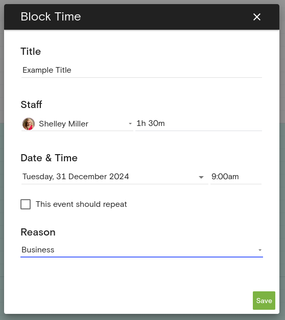

1. From the [dashboard](https://dashboard.boulevard.io/home), navigate to the [Calendar](https://dashboard.boulevard.io/dashboard) tab

2. Click on the desired time to start a block to reveal the dialog box with "Block Time" option
    - You can also click-and-drag to cover a range all at once

3. Block time
    - Add a title
    - Ensure the following:
        - Staff member is correct
        - Duration of time
        - Date and time
        - Whether or not the event should repeat (for weekly blocks)
        - Reason (personal block or block for business reasons)
    - Example: to block from 10am to 4pm, start a block at 10am and give a duration of 6 hours

