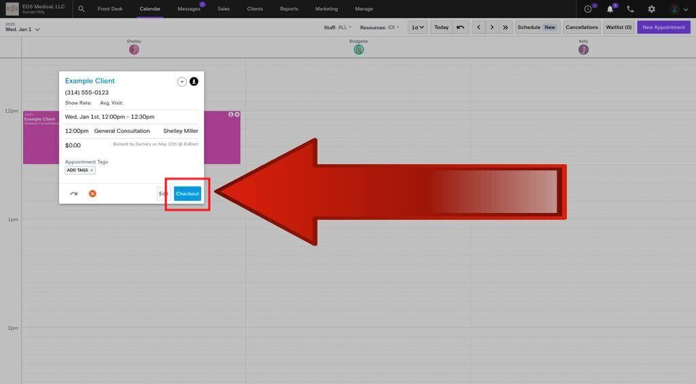

# User Interface: Checkout

### Method 1 (Client has appointment - receiving service)
- Go to [Front Desk](https://dashboard.boulevard.io/home) or [Calendar](https://dashboard.boulevard.io/calendar)
- Click on an appointment
- (If applicable) Click the green button(s) "Mark as Confirmed" and "Mark as Arrived"
- Click the green button "Checkout"
- Checkout panel will appear in the bottom-right corner of the browser (Microsoft Edge, Google Chrome, etc.)

### Method 2 (Client does not have appointment - product only)
- Go to [Sales](https://dashboard.boulevard.io/sales)
- Click on black "New Sale" button
- Checkout panel will appear in the bottom-right corner of the browser (Microsoft Edge, Google Chrome, etc.)

## Example View
