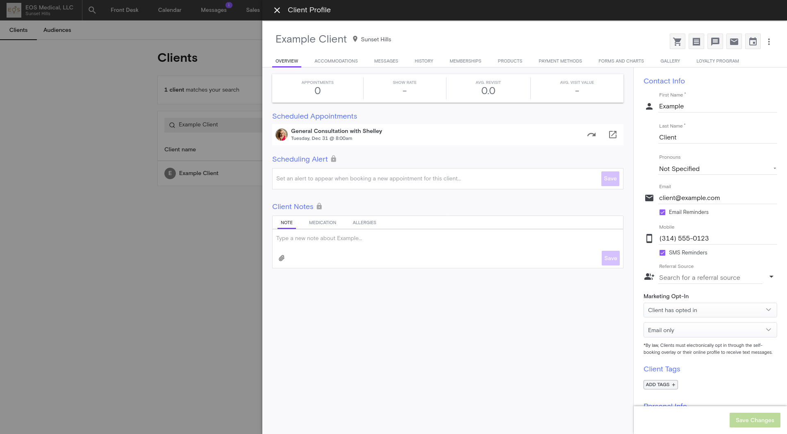

# User Interface: Client Profile

#### Method 1: Clicking on a client's name
- Client profile is accessible with a click anytime you see a client's name in blue font with an underline (link format)
- Client profile panel will flyout from the right side of the browser window (Microsoft Edge, Google Chrome, etc.)

#### Method 2: From the [Clients](../clients/index.md) tab
- (If applicable) Search for the client's name
- Click on the row containing the client's information
- Client profile panel will flyout from the right side of the browser window (Microsoft Edge, Google Chrome, etc.)

## Example View

