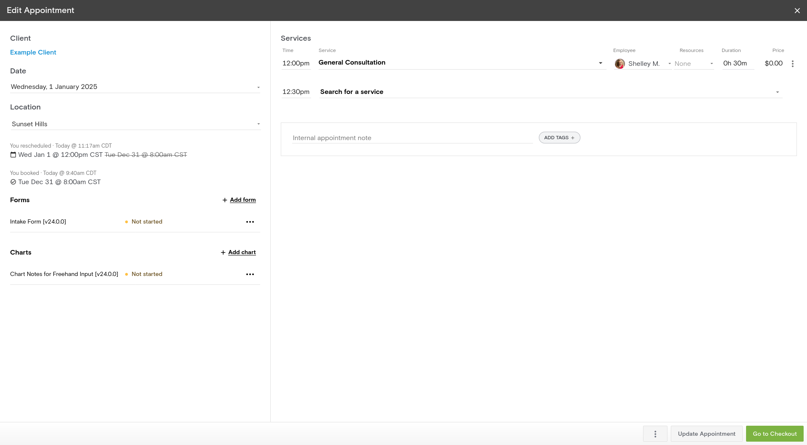

# User Interface: View (or Edit) Appointment

Method 1: From the History tab of a [Client Profile](../client-profile/index.md)
- Under "History", find the appointment to view
- Click the Box-with-Arrow symbol (View appointment) on the right side of the item's row

Method 2: From the Overview tab of a [Client Profile](../client-profile/index.md) in the "Scheduled Appointments" section
- Under "Scheduled Appointments" find the appointment to view
- Click the Box-with-Arrow symbol (View appointment) on the right side of the item's row

Method 3: By clicking on an appointment in the [Front Desk](../front-desk/index.md) or [Calendar](../calendar/index.md)
- On click, a dialog box pops up
- In the dialog box, click the "Edit" button

## Example View
